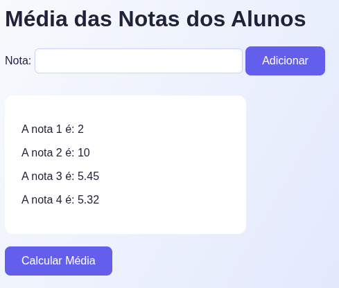
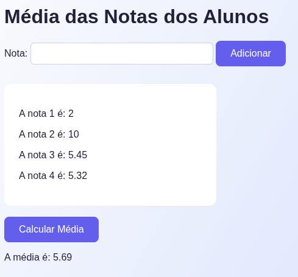

# Calculadora de Média

Uma aplicação web simples para calcular a média das notas de alunos.

## Tecnologias utilizadas

- HTML5
- CSS3
- JavaScript (Vanilla JS)

## Funcionalidades

- Adicionar notas de 0 a 10.
- Visualizar todas as notas adicionadas.
- Calcular a média das notas inseridas.
- Mensagens de erro para entradas inválidas.
- Adição de notas ao pressionar "Enter".

## Como usar

1. Clone o repositório ou faça download dos arquivos.
2. Abra o arquivo `index.html` em um navegador.
3. Digite a nota no campo de entrada e clique em "Adicionar" ou pressione "Enter".
4. Para calcular a média, clique em "Calcular Média".

## Layout e Estilo

O projeto utiliza CSS moderno com:

- Gradientes de fundo
- Bordas arredondadas
- Botões estilizados com efeito hover
- Caixa de notas com scroll personalizado

## Demonstração

### Tela inicial

### Adicionando notas

### Resultado da média

### Mensagens de erro

## Autor

Pedro Lucas Motta | Estudante de Tecnologia em Sistemas da Computação – UFF
